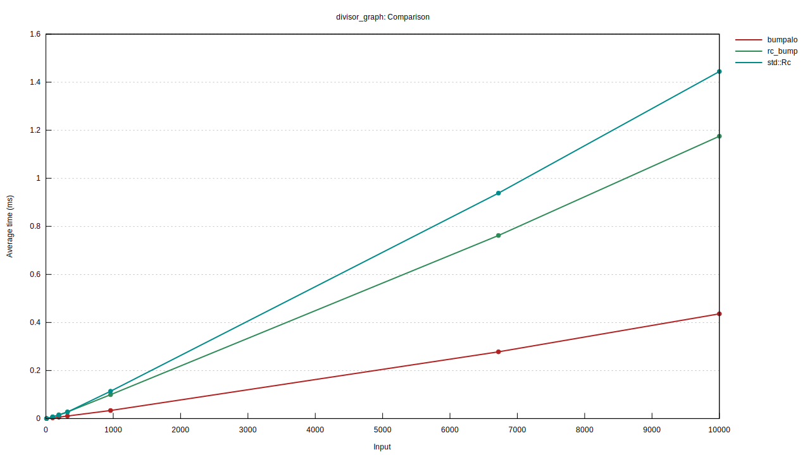

An intermediate between Bumpalo and Rc, by sharing the reference counter for a whole chunk of memory, `rc_bump` allows you to have better performances than `Rc` without the hassle of `bumpalo`'s lifetimes.

## Benchmarks

